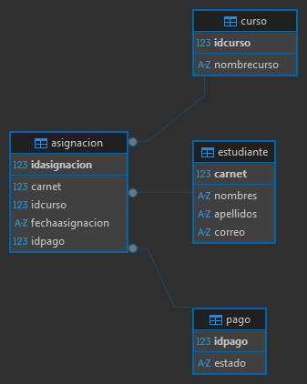

# Gestión de Inscripciones

## Descripción
Sistema de escritorio para la gestión de inscripciones en cursos. Permite administrar estudiantes, cursos, inscripciones, asignaciones y pagos, y ofrece vistas para ver y verificar la información capturada.

## Funcionalidades principales
- **Registro de estudiantes**

- **Gestión de cursos**

- **Inscripciones / Asignaciones** 

- **Pagos** 

- **Verificación** 

## Tecnologías
- **Lenguaje:** Java
- **UI:** JavaFX (FXML)
- **Gestor de dependencias:** Maven (incluye `mvnw` / `mvnw.cmd`)
- **Base de datos:** SQLite

## Diagrama (ERD)


## Requisitos previos
- JDK 11 o superior (se recomienda JDK 17 para compatibilidad con `module-info.java`).
- Maven (se puede usar el wrapper `./mvnw` o `mvnw.cmd` en Windows).
- MySQL u otra base de datos compatible instalada y en ejecución.

## Configuración de la base de datos
1. Cree una base de datos (por ejemplo `gestion_inscripciones`).
2. Si dispone de un archivo SQL de respaldo, impórtelo usando MySQL Workbench o desde la línea de comandos:

```powershell
mysql -u root -p proyecto_inscripciones < backup.sql
```

3. Configure los parámetros de conexión en la clase `Conexion.java` (o el archivo de configuración que use el proyecto). Asegúrese de no subir credenciales reales al repositorio.

## Ejecutar el proyecto

Desde Windows PowerShell en la raíz del proyecto:

```powershell
# Construir
.\mvnw.cmd clean package

# Ejecutar desde IDE (recomendado): abrir el proyecto en su IDE (IntelliJ/Eclipse) y lanzar la clase Application

# Ejecutar con Maven (si está configurado el plugin javafx):
.\mvnw.cmd javafx:run
```

Si no usa el plugin de JavaFX en Maven, ejecute desde el IDE o construya el JAR y lance con el classpath y el módulo de JavaFX adecuados.

## Sugerencias para desarrollo
- Abra el proyecto en su IDE favorito y marque `Application.java` como clase de entrada.
- Revise `module-info.java` si necesita ajustar módulos o dependencias de JavaFX.